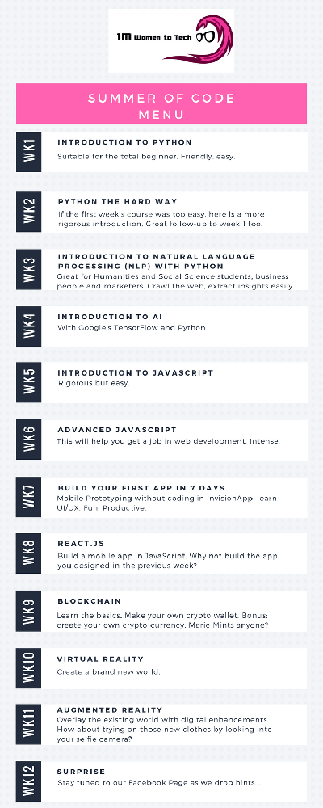

# 1MWTT - Summer of Code 2018

# Introduction

[One Million Women to Tech – women’s Summer of Code 2018](https://1millionwomentotech.com/summerofcode1/) is a 3-month global program focused on bringing more females into software development. Women can take free online coding courses and work in teams on programming challenges in weekly and monthly hackathons. 

# About

This repository contain additional materials(resources) for my students during Summer of Code based from [toolkitten](https://github.com/1millionwomentotech/toolkitten). Each of my student is encourage to fork this repository and committing to their own fork.

# Courses

# Hackathons

Hacking is creative problem solving. (It does not have to involve technology.)
A hackathon is any event of any duration where people come together to solve problems. Most hackathons I’ve run also have a parallel track for workshops.
Participants typically form groups of about 2-6 individuals, take out their laptops (if the event is technology themed), and dive into problems. Training workshops are a great parallel track especially for newcomers but also for all participants.

## Positive energy

Hackathons have gotten a bad rap because of some that have an unhealthy, competitive structure, and for setting unrealistic expectations. Don’t participate in hackathon with that mindset and you’ll be on the right track. Here are the goals to keep in mind:

## Strengthen the community that the hackathon is for.

Be welcoming to newcomers to the community.
Provide an opportunity for participants to learn something new.
Provide a space and a time for participants to make headway on problems they are interested in.
Don’t expect to have actually solved a problem by the end of the hackathon. Real life problems are hard! Think of the hackathon as a pit-stop on a long journey to solve problems or as a training session to prepare participants for solving problems.

Since you’re not going to solve a problem, don’t put unrealistic (and unhealthy) pressure on your participants. Don’t stay up all night, don’t pump yourself with caffeine, and don’t make winners and losers. Just don’t. Participants should come energized and be greeted with positive energy.

## Welcoming newcomers

The hardest thing about running a successful hackathon is being welcoming to newcomers and helping them get involved in an activity.

Newcomers often suffer from “imposter syndrome”, the feeling that they don’t belong because they don’t have skills, aren’t smart enough, etc. They’re wrong, of course, but until they feel like they belong they will not be able to have a fulfilling experience. It is the hackathon organizers', the mentors' and the more experienced participants' job to help them realize they have something to contribute.

First time hackathon participants are often overwhelmed when it comes time to finding a project to work on. They may not yet know how to relate their own skills to the sorts of projects being worked on. Knowing how to be useful is a skill in itself. You will need to guide them to a project and through a process for them to realize how they can contribute. If you have too many lost participants and not enough help in getting them started on a project, they will leave — let's try to avoid that.

## Hackhaton Schedule

Throughout the Summer of Code there are 12 weekly hackathons, 3 monthly hackathons, and 1 all-summer hackathon. Participants may enter one or more.

The weekly hackathons follow the theme of the week's course module so Week 1 is "Introduction to Python", and the hackathon is for entry level Python hacks, and so on.

The monthly hackathon's follow the tracks so Month 1 hackathon is for Python hacks, Month 2 for JavaScript hacks, and Month 3 for all the AR, VR, and Blockchain hacks.

The all-summer hackathon is an open category so that those who have a project in mind can use the Summer of Code as an opportunity to develop their idea into a prototype or even an MVP and have a chance to showcase it.

|Name | Type | Dates | Theme | Project Ideas|
|---|--- | --- | --- | ---|
|Week 1| Themed |July 14 - 20 | Introduction to Python||
|Week 2| Themed |July 21 - 27 | Python the Hard Way||
|Week 3| Themed |July 28 - August 3 | Natural Language Processing with Python||
|Week 4| Themed |August 4 - 10 |Artificial Intelligence with Python & Tensorflow||
|Week 5| Themed |August 11 - 17 | Introductory JavaScript||
|Week 6| Themed |August 18 - 24  |Advanced JavaScript||
|Week 7| Themed |August 25 - 31  |Mobile Prototyping (UI/UX) in InvisionApp||
|Week 8|Themed |September 1 - 7 |Mobile App Development with React.JS||
|Week 9| Themed |September 8 - 14 |Blockchain||
|Week 10| Themed |September 15 - 21 |Virtual Reality||
|Week 11| Themed |September 22 - 28 |Augmented Reality||
|Week 12| Themed |September 29 - October 5   |TBD (best suited for senior developers with a broad skill set)||
|Month 1|Open Ended |July 14 - August 10 |Python||
|Month 2| Open Ended |August 11 - Septeber 7 |JavaScript| |
|Month 3| Open Ended |September 8 - October 5 |Blockchain, AR, VR||
|All Summer| Open Ended |July 14 - Oct 14|Any topic |  |
